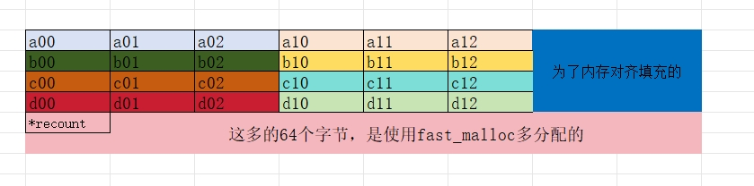

# EasyNN的Mat设计

​	EasyNN采用引用计数法来管理内存数据

## Mat类的属性值

```c++
size_t dims;     //数据的维度 0 or 1 or 2 or 3 or 4
int c;     
int d;      
int h;
int w;
size_t cstep;
size_t elemsize;
void* data;       //data的数据  
int* refcount;   //引用计数的地址 
```

​	data是Mat中矩阵数据实际的存储地址，refcount是引用计数指针，它的位置在data数据的末尾。elemsize是矩阵中每个元素的字节数。dims,w,h,d,c表明数据的维数。cstep是每个channel数据的个数。

## 构造函数、拷贝构造等构造函数实现

```c++
Mat::Mat():dims(0),c(0),d(0),h(0),w(0),cstep(0),data(0),refcount(0),elemsize(0)
{
}
Mat::Mat(int _w,size_t _elemsize):dims(0),c(0),d(0),h(0),w(0),cstep(0),data(0),refcount(0),elemsize(0)
{
    Mat::create(_w,_elemsize);
}
Mat::Mat(int _w,int _h,size_t _elemsize):dims(0),c(0),d(0),h(0),w(0),cstep(0),data(0),refcount(0),elemsize(0)
{
    Mat::create(_w,_h,_elemsize);
}
Mat::Mat(int _w,int _h,int _c,size_t _elemsize):dims(0),c(0),d(0),h(0),w(0),cstep(0),data(0),refcount(0),elemsize(0)
{
    Mat::create(_w,_h,_c,_elemsize);
}
Mat::Mat(int _w,int _h,int _d,int _c,size_t _elemsize):dims(0),c(0),d(0),h(0),w(0),cstep(0),data(0),refcount(0),elemsize(0)
{
    Mat::create(_w,_h,_d,_c,_elemsize);
}
Mat::Mat(const Mat& m):dims(m.dims),c(m.c),d(m.d),h(m.h),w(m.w),cstep(m.cstep),data(m.data),refcount(m.refcount),elemsize(m.elemsize)
{
    add_ref();
}
Mat::Mat(int _w,void* data,size_t _elemsize):dims(1),c(1),d(1),h(1),w(_w),data(data),refcount(0),elemsize(_elemsize)
{
    cstep = _w;
}
Mat::Mat(int _w,int _h,void* data,size_t _elemsize):dims(2),c(1),d(1),h(_h),w(_w),data(data),refcount(0),elemsize(_elemsize)
{
    cstep = _w*_h;
} 
Mat::Mat(int _w,int _h,int _c,void* data,size_t _elemsize):dims(3),c(_c),d(1),h(_h),w(_w),data(data),refcount(0),elemsize(_elemsize)
{
    cstep=alignSize((size_t)w * h * elemsize, 16) / elemsize;
}
Mat::Mat(int _w,int _h,int _d,int _c,void* data,size_t _elemsize):dims(4),c(_c),d(_d),h(_h),w(_w),data(data),refcount(0),elemsize(_elemsize)
{
    cstep = alignSize((size_t)w*h*d*elemsize, 16) / elemsize;
}

Mat& Mat::operator=(const Mat& m)
{
    if (this == &m)
        return *this;

    if (m.refcount)
        *m.refcount= *m.refcount+1;

    clean();

    data = m.data;
    refcount = m.refcount;
    elemsize = m.elemsize;

    dims = m.dims;
    w = m.w;
    h = m.h;
    d = m.d;
    c = m.c;

    cstep = m.cstep;

    return *this;
}
```

## Create函数

```c++
void Mat::create(int _w,size_t _elemsize)
{
    clean();
    dims=1;
    w=_w;
    h=1;
    d=1;
    c=1;
    cstep = _w;
    elemsize = _elemsize;
    size_t totalsize = alignSize(total(), 4);

    if(totalsize>0)
    {
        data = fastMalloc(totalsize);
    }
    else
    {
        printf("totalsize <0\n");
    }
    if(data)
    {
        refcount=(int*)((unsigned char *)data+totalsize);
        *refcount=1;
    }
}

void Mat::create(int _w,int _h,size_t _elemsize)
{
    clean();
    dims=2;
    w=_w;
    h=_h;
    d=1;
    c=1;
    cstep = _w*_h;
    elemsize = _elemsize;
    size_t totalsize = alignSize(total(), 4);

    if(totalsize>0)
    {
        data = fastMalloc(totalsize);
    }
    else
    {
        printf("totalsize <0\n");
    }
    if(data)
    {
        refcount=(int*)((unsigned char *)data+totalsize);
        *refcount=1;
    }          

}
void Mat::create(int _w,int _h,int _c,size_t _elemsize)
{   
    clean();
    dims=3;
    w=_w;
    h=_h;
    d=1;
    c=_c;
    elemsize = _elemsize;
    cstep = alignSize((size_t)w * h * elemsize, 16) / elemsize;
    size_t totalsize = alignSize(total(), 4);
    
    if(totalsize>0)
    {
        data = fastMalloc(totalsize);
    }
    else
    {
        printf("totalsize <0\n");
    }
    if(data)
    {
        refcount=(int*)((unsigned char *)data+totalsize);
        *refcount=1;
    }         
}

void Mat::create(int _w,int _h,int _d,int _c,size_t _elemsize)
{   
    clean();
    dims=4;
    w=_w;
    h=_h;
    d=_d;
    c=_c;
    elemsize = _elemsize;
    cstep = alignSize((size_t)w*h*d*elemsize, 16) / elemsize;
    size_t totalsize = alignSize(total(), 4);
    
    if(totalsize>0)
    {
        data = fastMalloc(totalsize);
    }
    else
    {
        printf("totalsize <0\n");
    }
    if(data)
    {
        refcount=(int*)((unsigned char *)data+totalsize);
        *refcount=1;
    }         
}
```

​	create函数实际上就是释放原来的数据内存，然后根据输入的大小和对齐规则来分配内存大小

## 遍历Mat

```c++
float* Mat::row(int y)
{
    return (float*)((unsigned char*)data + (size_t)w * y * elemsize);
}

float* Mat::row(int y) const
{
    return (float*)((unsigned char*)data + (size_t)w * y * elemsize);
}


Mat Mat::depth(int z)
{
    return Mat(w, h, (unsigned char*)data + (size_t)w * h * z * elemsize, elemsize);
}

Mat Mat::depth(int z) const
{
    return Mat(w, h, (unsigned char*)data + (size_t)w * h * z * elemsize, elemsize);
}

Mat Mat::channel(int _c)
{
    Mat m(w, h, d, (unsigned char*)data + cstep * _c * elemsize, elemsize);
    m.dims = dims - 1;
    if (dims == 4)
        m.cstep = (size_t)w * h;
    return m;
}

Mat Mat::channel(int _c) const
{
    Mat m(w, h, d, (unsigned char*)data + cstep * _c * elemsize, elemsize);
    m.dims = dims - 1;
    if (dims == 4)
        m.cstep = (size_t)w * h;
    return m;
}

float& Mat::operator[](size_t index)
{
    return ((float*)data)[index];
}

float& Mat::operator[](size_t index) const
{
    return ((float*)data)[index];
}
```

​	提供了各个维度遍历Mat的接口,重载了运算符[]。可以使用如下来遍历Mat

```c++
void printMat(const easynn::Mat& m)
{
    if(m.isEmpty())
    {
        printf("mat is empty\n");
        return ;
    } 
    printf("d=%d,c=%d,h=%d,w=%d \n",m.d,m.c,m.h,m.w);
    for (int q=0; q<m.c; q++)
    {
        float* ptr = m.channel(q);
        for (int z=0; z<m.d; z++)
        {
            for (int y=0; y<m.h; y++)
            {
                for (int x=0; x<m.w; x++)
                {
                    printf("%f ", ptr[x]);
                }
                ptr += m.w;
                printf("\n");
            }
            printf("\n");
        }
        printf("\n");
    }
}
```

## 维度变换

```c++
Mat Mat::reshape(int _w) const
{
    if (w * h * d * c != _w)
        return Mat();

    if (dims >= 3 && cstep != (size_t)w * h * d)
    {
        Mat m;
        m.create(_w, elemsize);

        // flatten
        for (int i = 0; i < c; i++)
        {
            const void* ptr = (unsigned char*)data + i * cstep * elemsize;
            void* mptr = (unsigned char*)m.data + (size_t)i * w * h * d * elemsize;
            memcpy(mptr, ptr, (size_t)w * h * d * elemsize);
        }

        return m;
    }

    Mat m = *this;

    m.dims = 1;
    m.w = _w;
    m.h = 1;
    m.d = 1;
    m.c = 1;

    m.cstep = _w;

    return m;
}

Mat Mat::reshape(int _w, int _h) const
{
    if (w * h * d * c != _w * _h)
        return Mat();

    if (dims >= 3 && cstep != (size_t)w * h * d)
    {
        Mat m;
        m.create(_w, _h, elemsize);

        // flatten
        for (int i = 0; i < c; i++)
        {
            const void* ptr = (unsigned char*)data + i * cstep * elemsize;
            void* mptr = (unsigned char*)m.data + (size_t)i * w * h * d * elemsize;
            memcpy(mptr, ptr, (size_t)w * h * d * elemsize);
        }

        return m;
    }

    Mat m = *this;

    m.dims = 2;
    m.w = _w;
    m.h = _h;
    m.d = 1;
    m.c = 1;

    m.cstep = (size_t)_w * _h;

    return m;
}

Mat Mat::reshape(int _w, int _h, int _c) const
{
    if (w * h * d * c != _w * _h * _c)
        return Mat();

    if (dims < 3)
    {
        if ((size_t)_w * _h != alignSize((size_t)_w * _h * elemsize, 16) / elemsize)
        {
            Mat m;
            m.create(_w, _h, _c, elemsize);

            // align channel
            for (int i = 0; i < _c; i++)
            {
                const void* ptr = (unsigned char*)data + (size_t)i * _w * _h * elemsize;
                void* mptr = (unsigned char*)m.data + i * m.cstep * m.elemsize;
                memcpy(mptr, ptr, (size_t)_w * _h * elemsize);
            }

            return m;
        }
    }
    else if (c != _c)
    {
        // flatten and then align
        Mat tmp = reshape(_w * _h * _c);
        return tmp.reshape(_w, _h, _c);
    }

    Mat m = *this;

    m.dims = 3;
    m.w = _w;
    m.h = _h;
    m.d = 1;
    m.c = _c;

    m.cstep = alignSize((size_t)_w * _h * elemsize, 16) / elemsize;

    return m;
}

Mat Mat::reshape(int _w, int _h, int _d, int _c) const
{
    if (w * h * d * c != _w * _h * _d * _c)
        return Mat();

    if (dims < 3)
    {
        if ((size_t)_w * _h * _d != alignSize((size_t)_w * _h * _d * elemsize, 16) / elemsize)
        {
            Mat m;
            m.create(_w, _h, _d, _c, elemsize);

            // align channel
            for (int i = 0; i < _c; i++)
            {
                const void* ptr = (unsigned char*)data + (size_t)i * _w * _h * _d * elemsize;
                void* mptr = (unsigned char*)m.data + i * m.cstep * m.elemsize;
                memcpy(mptr, ptr, (size_t)_w * _h * _d * elemsize);
            }

            return m;
        }
    }
    else if (c != _c)
    {
        // flatten and then align
        Mat tmp = reshape(_w * _h * _d * _c);
        return tmp.reshape(_w, _h, _d, _c);
    }

    Mat m = *this;

    m.dims = 4;
    m.w = _w;
    m.h = _h;
    m.d = _d;
    m.c = _c;

    m.cstep = alignSize((size_t)_w * _h * _d * elemsize, 16) / elemsize;
    return m;
}
```

​	总体思路，都先展开为一维，让所有的数据都连续，再变换到其他的维度。

## Mat的赋值

```c++
void Mat::fill(float x)
{
    if(isEmpty())
    {
        return ;
    } 
    for(int i=0;i<c;i++){
        float *ptr = this->channel(i);
        for(int z=0;z<d;z++){
            for(int j=0;j<h;j++){
                for(int k=0;k<w;k++){
                    ptr[k]=x;
                }
                ptr = ptr+w;
            }
        }
    }   
}

void Mat::fillFromArray(std::vector<std::vector<float>> x)
{
    if(dims!=2)
    {
        printf("dims not match\n");
        return ;
    }

    if(isEmpty()||x.empty())
    {
        printf(" vector or mat empty\n");
        return ;
    }

    if(x.size()!=h|| x[0].size()!=w)
    {
        printf(" vector and mat size not match\n");
        return ;
    }

    for(int i=0;i<c;i++){
        float *ptr = this->channel(i);
        for(int z=0;z<d;z++){
            for(int j=0;j<h;j++){
                for(int k=0;k<w;k++){
                    ptr[k]=x[j][k];
                }
                ptr = ptr+w;
            }
        }
    }    
}
```

​	支持两种赋值，一种是所有的都赋成一个值，另外一种是从vector中赋值。

## Mat的内存分布图

 	以生成一个3×2×4的矩阵为例

```c++
EastNN::Mat mat1(3,2,4)
```

​	会调用如下的构造函数

```c++
Mat::Mat(int _w,int _h,int _c,size_t _elemsize):dims(0),c(0),d(0),h(0),w(0),cstep(0),data(0),refcount(0),elemsize(0)
{
    Mat::create(_w,_h,_c,_elemsize);
}
```

​	所有的属性值都赋值为0，然后调用create函数。其中`Mat(int w, int h, int c, size_t elemsize = 4u）`elemsize有默认值为4，即32位。

​	下面是create函数的实现：

```c++
void Mat::create(int _w,int _h,int _c,size_t _elemsize)
{   
    clean();
    dims=3;
    w=_w;
    h=_h;
    d=1;
    c=_c;
    elemsize = _elemsize;
    cstep = alignSize((size_t)w * h * elemsize, 16) / elemsize;
    size_t totalsize = alignSize(total(), 4);
    
    if(totalsize>0)
    {
        data = fastMalloc(totalsize);
    }
    else
    {
        printf("totalsize <0\n");
    }
    if(data)
    {
        refcount=(int*)((unsigned char *)data+totalsize);
        *refcount=1;
    }         
}
```

​	如果Mat前面本来就有数据的话，其内存数据就会被释放。再分别给属性赋值。

​	EasyNN的Mat是在channel维度上对齐，这主要是因为EasyNN在每个维度上用openmp多线程加速，已经考虑到armv8加速的原因。alignSize是字节对齐的函数，，就一行代码`(sz + n - 1) & -n;`给大家举个例子说明：

​	sz=w×h×elemsize=3×2×4=24,则

​	(sz + n - 1) & -n

​	=32

​	然后32/4=8，则cstep=8

类似的totalsize也会字节对齐，然后再使用fastMalloc分配内存，实际分配的内存还会对64个字节(这个在前面提到过)，最后Mat在内存中的图是这样的：


## Mat的浅拷贝

```c++
Mat& Mat::operator=(const Mat& m)
{
    if (this == &m)
        return *this;

    if (m.refcount)
        *m.refcount= *m.refcount+1;

    clean();

    data = m.data;
    refcount = m.refcount;
    elemsize = m.elemsize;

    dims = m.dims;
    w = m.w;
    h = m.h;
    d = m.d;
    c = m.c;

    cstep = m.cstep;

    return *this;
}
```

​	Mat的浅拷贝实际就是refcount加1。

## Mat的深拷贝

```c++
Mat Mat::clone() const
{
    if (isEmpty())
        return Mat();

    Mat m;
    if (dims == 1)
        m.create(w, elemsize);
    else if (dims == 2)
        m.create(w, h, elemsize);
    else if (dims == 3)
        m.create(w, h, c, elemsize);
    else if (dims == 4)
        m.create(w, h, d, c, elemsize);

    if (total() > 0)
    {
        memcpy(m.data, data, total());
    }
    return m;
}

```

​	代码也很简单，创建一个局部的Mat，把数据拷贝一份，然后返回即可。

## Mat的释放

```c++
void Mat::clean()
{   
    if(refcount && (*refcount-=1)==0)
    {
        fastFree(data);
    }
    dims = 0;
    w = 0;
    h = 0;
    d = 0;
    c = 0;

    cstep = 0;
    data = 0;
    refcount = 0;

}  refcount = 0;
}
```

​	判断refcount，如果不为空且为1，则释放内存。 
